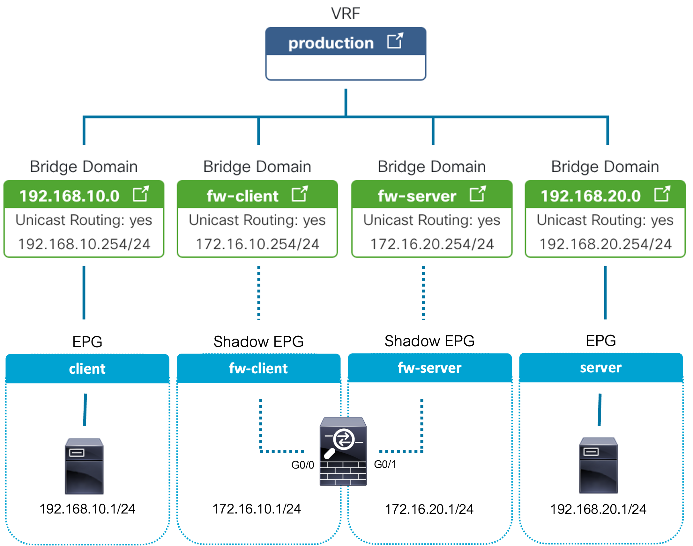
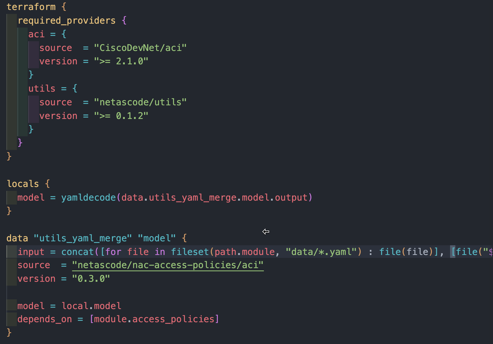
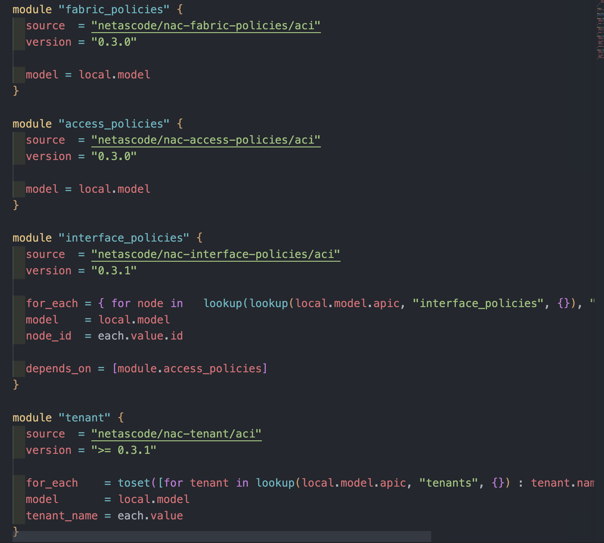

# EMEA PVT Nexus as Code Lab - Service Integration

This section provides an example of integrating a firewall into an existing ACI fabric. Because Terraform assumes full control of the lifecycle of the resources it creates, this example only contains the tenant module and definitions. That way any existing ACI configuration will not be impacted.

Before deploying this scenario, please follow the Nexus-as-code (NaC) ACI Simple Example to ensure you understand the NaC concepts.

The NaC Simple Example can be found at: https://developer.cisco.com/docs/nexus-as-code/#!simple-example/nexus-as-code-aci-simple-example

This example assumes you have installed the following prerequisites.

- Terraform 1.3.0 or later.
- Git
- Your preferred text editor / Integrated Development Environment (IDE) (such as VisualStudio Code)

## Example Scenario - Redirect Client to Server Traffic through an ASAv with ACI PBR

This example deploys a new ACI tenant and sets up Policy Based Redirect to steer HTTP traffic from a client EPG through an ASAv to a server EPG. There are multiple options to implement connectivity and the following scenario will configure two service EPGs and two service BDs to which the arms of the firewall will be connected.



While either a physical or a virtual firewall would be supported, in this example scenario it is assumed an ASAv will exist in a VMware vSphere cluster connected to the ACI fabric. The NaC configuration has been provided to deploy the VMware VMM integration.

> **Note**
> If you are using UCS with Fabric Interconnects the VLANs above must also exist on the Fabric Interconnects. The must also be associated with the respective vNICs assigned to the servers on which the ASAv and client/server VMs are running.

It is assumed that two VMs have already been provisioned, one client and one server. In the creation of this scenario 2 x Ubuntu 20.04 VMs were deployed.

## Getting Started

* Start by cloning the repository to your local system:

```cli
git clone https://github.com/conmurphy/emea-pvt-2022-nac-service-integration
```

* Open the folder in your preferred editor / IDE.

The working area should look like this (the editor shown here is vsCode):




As explained in the Introduction, line 1-28 in the main.tf file contain the required providers, provider settings and merges all *.yaml file definitions located in the data folder. This example will use the following modules:

* `tenant`: provisions the tenant, application profiles + related resources, and service graph 
* `fabric`: provisions the run VMM policy
* `access and interface`: provisions the VLAN pools and required CDP/LLDP policies

## Step 1: Pre-requisites and ASAv Configuration

> **Note**
> Since this lab is using the ACI simulator it  will not be possible to forward  traffic. Therefore the configuration below is for an example only.

### ASAv Configuration

> **Warning**
> This ASA configuration is not production ready and has been configured to provide connectivity in this example scenario.

```
cisco-asav-1# show run
: Hardware:   ASAv, 2048 MB RAM, CPU Xeon E5 series 2600 MHz
:
ASA Version 9.16(3)19
!
hostname cisco-asav-1

!
interface GigabitEthernet0/0
 nameif outside
 security-level 100
 ip address 172.16.10.1 255.255.255.0
!
interface GigabitEthernet0/1
 nameif inside
 security-level 100
 ip address 172.16.20.1 255.255.255.0
!
interface Management0/0
 no management-only
 nameif management
 security-level 0
 ip address dhcp
!
same-security-traffic permit inter-interface
!
access-list inside_access extended permit ip any4 any4
access-group inside_access in interface inside
!
access-list outside_access extended permit ip any4 any4
access-group outside_access in interface outside
!
route management 0.0.0.0 0.0.0.0 10.1.100.254 1
route outside 192.168.10.0 255.255.255.0 172.16.10.254 1
route inside 192.168.20.0 255.255.255.0 172.16.20.254 1
!
http server enable
http 10.0.0.0 255.0.0.0 management
```

## Step 2: Tenant Validation

An example tenant definition is provided in `data/tenant_nac_l4l7.yaml`. This is where the data (variable definition) is abstracted from the logic (infrastructure declaration).

Navigate to the `data` folder and note that there are three `YAML` files. 

- `data/tenant_nac_l4l7.yaml` - configures the tenant, AP, EPGs, VRF, BDs, Contracts, and Filters
- `data/l4l7_service_graph.yaml` - configures the service graph and attaches to the web contract
- `data/vmm_access_policies.yaml` - configures the VMM integration and VLAN pools

This example provisions the following ACI resources

- Tenant
  - nac_l4l7
- EPGs
  - client
  - server
- VRFs
  - production
- BDs
  - 192.168.10.0 (GW: 192.168.10.254/24)
  - 192.168.20.0 (GW: 192.168.20.254/24)
  - 172.16.10.0 (GW: 172.16.10.254/24)
  - 172.16.20.0 (GW: 172.16.20.254/24)
- Contracts - Redirected to ASA
  - http permit any any
- Contracts - NOT Redirected
  - icmp permit any any
- L4-L7 Policy-Based Redirect
  - client
  - server
- L4-L7 Device
  - asav
- L4-L7 Service Graph Template
  - asa-routed
- L4-L7 Device Selection Policy
  - asa-routed

> **Note**
> If you already have a tenant named nac_l4l7 in your ACI infrastructure, you must alter the tenant name in the tenant_nac_l4l7.yaml file to avoid overlap. The name of the yaml file itself is arbitrary.

> **Note**
> The following properties from the configuration below should be updated to match your environment
> - l3_destination mac

`data/tenant_nac_l4l7.yaml`
```yaml
---
apic:
  tenants:
    - name: nac_l4l7

      vrfs:
        - name: nac_l4l7.production

      bridge_domains: 
        - name: 192.168.10.0_24
          vrf: nac_l4l7.production
          subnets: 
          - ip: 192.168.10.254/24 
        - name: 192.168.20.0_24
          vrf: nac_l4l7.production
          subnets: 
          - ip: 192.168.20.254/24 
        - name: fw-client_24
          vrf: nac_l4l7.production
          subnets: 
          - ip: 172.16.10.254/24
        - name: fw-server_24
          vrf: nac_l4l7.production
          subnets: 
          - ip: 172.16.20.254/24


      application_profiles:
        - name: segments
          endpoint_groups:
            - name: client
              bridge_domain: 192.168.10.0_24
              contracts:
                consumers:
                  - web-db
              vmware_vmm_domains:
                - name: My-vCenter
                  delimiter: '|'
                  deployment_immediacy: immediate
                  resolution_immediacy: immediate
            - name: server
              bridge_domain: 192.168.20.0_24
              contracts:
                providers:
                  - web-db
              vmware_vmm_domains:
                - name: My-vCenter
                  delimiter: '|'
                  deployment_immediacy: immediate
                  resolution_immediacy: immediate

      filters:
        - name: icmp-src-any-to-dst
          entries:
            - name: src-any-to-dst
              ethertype: ip
              protocol: icmp
        - name: tcp-src-any-to-dst-80
          entries:
            - name: src-any-to-dst-80
              ethertype: ip
              protocol: tcp
              destination_from_port: http
              destination_to_port: http

      contracts:
        - name: web-db
          subjects:
            - name: icmp
              filters:
                - filter: icmp-src-any-to-dst
              service_graph: asa-routed
            - name: web
              filters:
                - filter: tcp-src-any-to-dst-80
      
```

`data/l4l7_service_graph.yaml`
```yaml
---
apic:
  tenants:
    - name: nac_l4l7
      managed: false
      
      services:
        l4l7_devices:
          - name: asav
            context_aware: single-Context
            type: VIRTUAL
            vmware_vmm_domain: My-vCenter 
            function: GoTo
            managed: false
            service_type: FW
            concrete_devices:
              - name: asav
                vcenter_name: vc1 
                vm_name: ASAv 
                interfaces:
                  - name: client
                    vnic_name: Network adapter 2
                  - name: server
                    vnic_name: Network adapter 3
            logical_interfaces:
              - name: client
                concrete_interfaces:
                  - device: asav
                    interface_name: client
              - name: server
                concrete_interfaces:
                  - device: asav
                    interface_name: server
        redirect_policies:
          - name: client
            l3_destinations:
              - ip: 172.16.10.1
                mac: 00:50:56:8E:F7:96 # CHANGE THIS TO MAC OF ASAV NETWORK ADAPTER 2
          - name: server
            l3_destinations:
              - ip: 172.16.20.1
                mac: 00:50:56:8E:51:93 # CHANGE THIS TO MAC OF ASAV NETWORK ADAPTER 3 
        service_graph_templates:
          - name: asa-routed
            template_type: FW_ROUTED
            redirect: true
            device:
              tenant: nac_l4l7
              name: asav
        device_selection_policies:
          - contract: web-db
            service_graph_template: asa-routed
            consumer:
              l3_destination: true
              redirect_policy:
                name: client
              logical_interface: client
              bridge_domain:
                name: fw-client_24
            provider:
              l3_destination: true
              redirect_policy:
                name: server
              logical_interface: server
              bridge_domain:
                name: fw-server_24
```

`data/vmm_access_policies.yaml`
```yaml
---
apic:
  access_policies:
    interface_policies:
      cdp_policies:
        - name: My-vCenter_cdpIfPol
          admin_state: true
      lldp_policies:
        - name: My-vCenter_lldpIfPol
          admin_rx_state: true
          admin_tx_state: true
      port_channel_policies:
        - name: My-vCenter_lacpLagPol
          mode: mac-pin
    vlan_pools:
      - name: vcenter-vlans
        description: "VLANs used by Vcenter VMM integration"
        allocation: dynamic
        ranges:
          - from: 3000
            to: 3050

  fabric_policies:
    vmware_vmm_domains:
    - name: My-vCenter
      access_mode: read-write
      vlan_pool: vcenter-vlans
      vswitch:
        cdp_policy: My-vCenter_cdpIfPol
        lldp_policy: My-vCenter_lldpIfPol
        port_channel_policy: My-vCenter_lacpLagPol
      credential_policies:
        - name: vCenterUser
          username: administrator@vsphere.local
          password: C1sco12345!
      vcenters:
        - name: vc1
          hostname_ip: 198.18.133.30
          datacenter: dCloud-DC
          credential_policy: vCenterUser
          dvs_version: 6.6
```

## Step 3: Tenant Deployment

Make sure to update provider block in the `main.tf` file in the root folder with the right credentials and APIC IP address. It is recommended to use signature based authentication. For more information see: [Terraform Provider Documentation](https://developer.cisco.com/docs/nexus-as-code/#!simple-example/step-2-tenant-deployment:~:text=Terraform%20Provider%20Documentation). The reason signature based authentication is preferred is due to APIC rate limiting requests from username and password-based authentication.

```hcl
provider "aci" {
  username = "username"
  password = "password"
  url      = "https://apic.url"
  insecure = true
  retries  = 4
}
```

Initialise Terraform:

```cli
terraform init
```

Run Terraform Apply:

```cli
terraform apply
```

Followed by `yes` to approve.

Upon success you should receive the following output:

```cli
Apply complete! Resources: 118 added, 0 changed, 0 destroyed.
```

Navigate to your APIC and verify that your new tenant `nac_l4l7` has been deployed successfully.

Navigate to the VMware VMM integration and confirm that the VMM policies have been created.

Navigate to Vcenter and confirm that you now how four new port groups on the new DVS. Two will be for the client and server, and two will be for the arms of the ASAv. You should also see that the network adapters on the ASAv VM have been added to these two new port groups.

## License

This project is licensed to you under the terms of the [Cisco Sample
Code License](./LICENSE).


